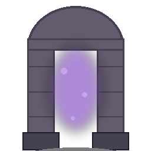

Spawns no unit. Deals 3 damage per second to any unit standing on one of its 4 adjacent cells.

Whenever a unit dies on one of those 4 cells (no matter what killed it), the Passing Gate recovers 3% of THAT unit's own resource value (whatever it would itself have plundered), converted to Gold.
