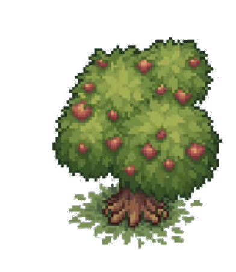

Produces 1 [Wood](Wood.md) per second.

Upgrade of the [Forest](Forest.md).

Home to Ents that deal 2 damage/sec to units passing on adjacent cells.

Every 10 seconds, spawns a [Wolf](Wolf.md).

Heals corruption (see [Corruption](../../Resources/Mort/Corruption.md)) on itself and the 8 surrounding buildings by 0.5% per second.
