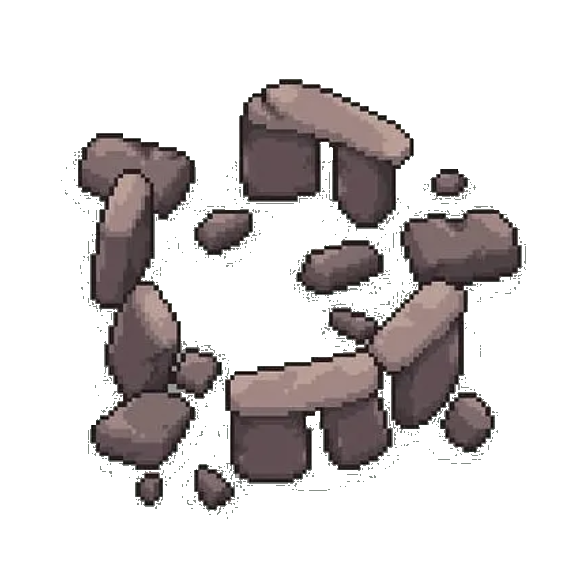

Spawns an [Animated Tree](Animated%20Tree.md) every 10 seconds, which heads out to attack the opponent like any other unit — but still counts toward Nature's victory condition (Unstoppable Expansion) for as long as it's alive, even while it's attacking.
