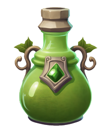

Upgrade of the [Base Lab](Base%20Lab.md) — not directly buildable.

Produces 0.2 [Crystal](Crystal.md) per second, boosted by 75% per level.

Then keeps upgrading further in place up to level 5, the same way any other building does (same mechanism as Grove → Forest → Jungle):

| Level | Cost | Crystal/sec | Effect |
| --- | --- | --- | --- |
| 1 | Free (granted when upgrading from the Base Lab) | 0.35 | -10% Nature building cost and build time |
| 2 | 15 Wood + 30 Crystal | 0.61 | -20% Nature building cost and build time |
| 3 | 45 Wood + 90 Crystal | 1.1 | -35% Nature building cost and build time |
| 4 | 135 Wood + 270 Crystal | 1.9 | -55% Nature building cost and build time |
| 5 | 405 Wood + 810 Crystal | 3.3 | -80% Nature building cost and build time |
