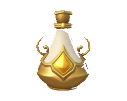

Upgrade of the [Base Lab](Base%20Lab.md) — not directly buildable.

Produces 0.3 [Crystal](Crystal.md) per second, boosted by 75% per research level.

Unlocks [Recherche fondamentale](../../Resources/Science/Recherche%20fondamentale.md), at level 1 as soon as it's upgraded (free).
