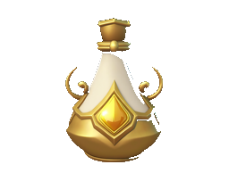

Upgrade of the [Base Lab](Base%20Lab.md) — not directly buildable.

Produces 0.3 [Crystal](Crystal.md) per second, boosted by 75% per level.

Then keeps upgrading further in place up to level 5, the same way any other building does (same mechanism as Grove → Forest → Jungle):

| Level | Cost | Crystal/sec | Effect |
| --- | --- | --- | --- |
| 1 | Free (granted when upgrading from the Base Lab) | 0.53 | wins outright once every other lab reaches level 5+ |
| 2 | 60 Crystal | 0.92 | wins outright once every other lab reaches level 4+ |
| 3 | 180 Crystal | 1.6 | wins outright once every other lab reaches level 3+ |
| 4 | 540 Crystal | 2.8 | wins outright once every other lab reaches level 2+ |
| 5 | 1620 Crystal | 4.9 | wins outright once every other lab reaches level 1+ |
