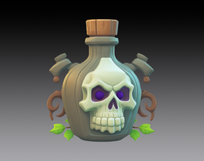

Upgrade of the [Base Lab](Base%20Lab.md) — not directly buildable.

Produces 0.2 [Crystal](Crystal.md) per second, boosted by 75% per level.

Then keeps upgrading further in place up to level 5, the same way any other building does (same mechanism as Grove → Forest → Jungle):

| Level | Cost | Crystal/sec | Effect |
| --- | --- | --- | --- |
| 1 | Free (granted when upgrading from the Base Lab) | 0.35 | +10% corruption speed |
| 2 | 15 Shadow + 30 Crystal | 0.61 | +25% corruption speed |
| 3 | 45 Shadow + 90 Crystal | 1.1 | +45% corruption speed |
| 4 | 135 Shadow + 270 Crystal | 1.9 | +75% corruption speed |
| 5 | 405 Shadow + 810 Crystal | 3.3 | +120% corruption speed |
