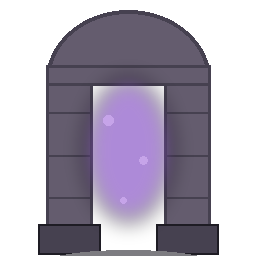

N'envoie aucune unité. Inflige 3 dégâts par seconde à toute unité se trouvant sur l'une de ses 4 cases adjacentes.

Chaque fois qu'une unité meurt sur l'une de ces 4 cases (peu importe ce qui l'a tuée), le Portail draine 3% des ressources totales actuelles de son propriétaire et les convertit en [Ombre](Ombre.md) bonus.
