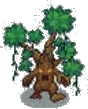

Se déplace lentement (1 case en 2 sec), comme un [Zombie](../Mort/Zombie.md).

Toutes les 10 secondes, il s'arrête pendant 3 secondes et invoque un nouvel Arbre Animé
sur la case où il serait allé, puis reprend sa marche. Ce nouvel Arbre Animé (comme
n'importe lequel de ses clones) fait 80% de la taille et des PV de celui qui l'a créé, et
peut lui-meme se cloner de la meme facon — jusqu'a un minimum de 20% de la taille
d'origine.

