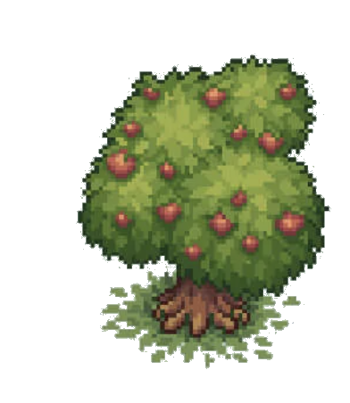

Produit 1 [Bois](Bois.md) par seconde.

Amélioration de la [Forêt](Foret.md).

Contient des Ents qui attaquent les unités passant sur les cases adjacentes pour 2 dégâts/sec.

Toutes les 10 secondes, génère un [Loup](Loup.md).

Soigne la corruption (voir [Corruption](../Mort/Corruption.md)) de lui-même et des 8 bâtiments environnants de 0.5% par seconde.
