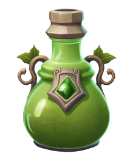

Amélioration du [Labo Fondamental](Labo%20Fondamental.md) — pas constructible directement.

Produit 0.2 [Crystal](Crystal.md) par seconde, augmenté de 75% par niveau.

S'améliore ensuite sur place jusqu'au niveau 5, comme n'importe quel autre bâtiment (même mécanisme que Bosquet → Forêt → Jungle) :

| Niveau | Coût | Effet |
| --- | --- | --- |
| 1 | Gratuit (obtenu en améliorant le Labo Fondamental) | -10% coût des bâtiments |
| 2 | 15 Bois + 30 Crystal | -20% coût des bâtiments |
| 3 | 45 Bois + 90 Crystal | -35% coût des bâtiments |
| 4 | 135 Bois + 270 Crystal | -55% coût des bâtiments |
| 5 | 405 Bois + 810 Crystal | -80% coût des bâtiments |
